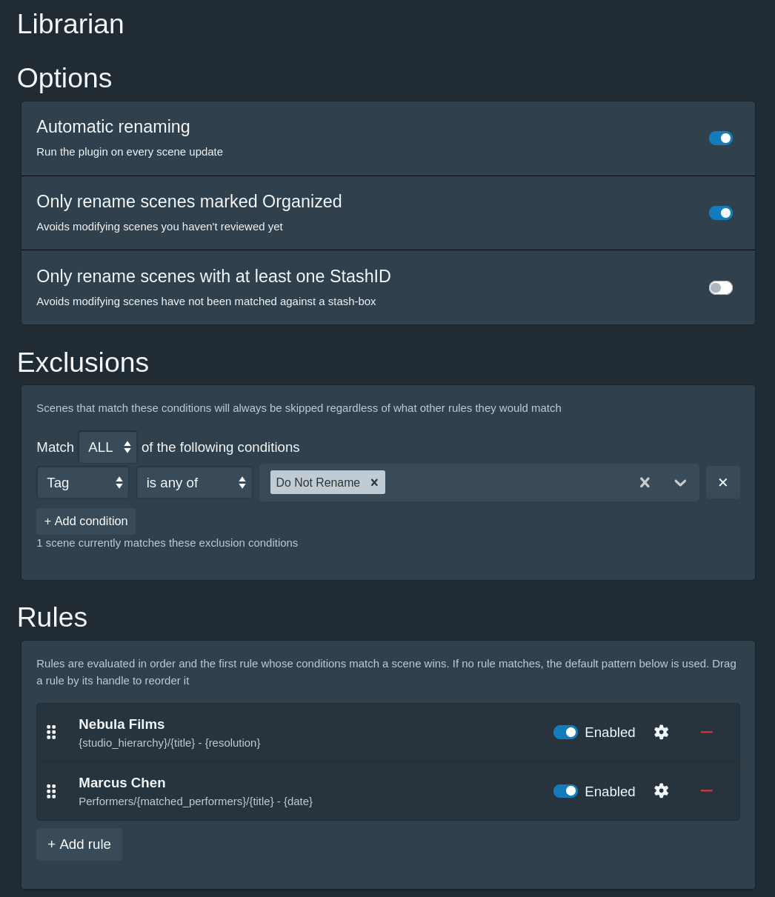
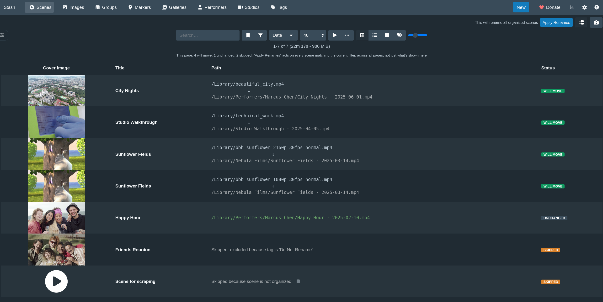
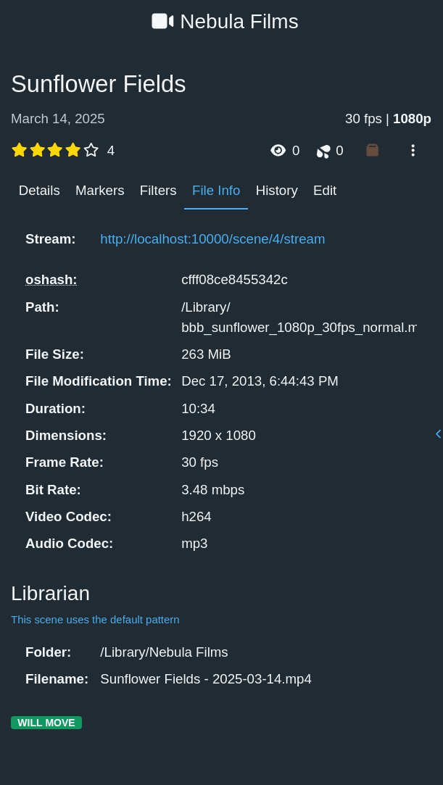
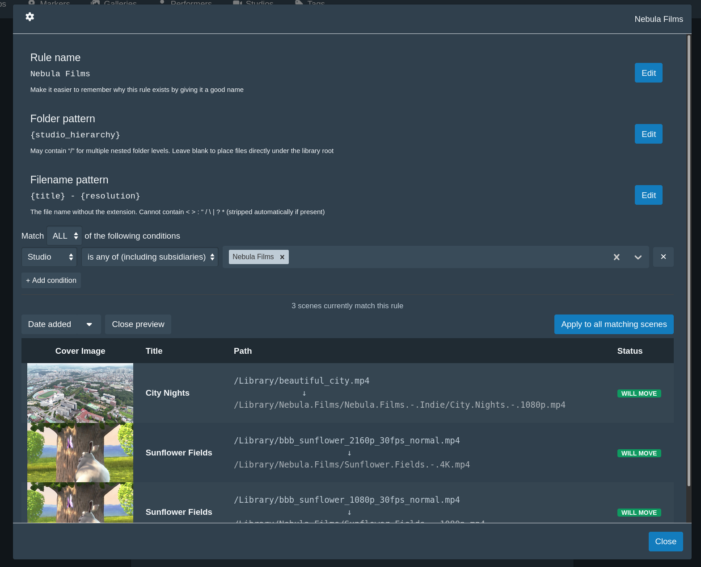

# Librarian

A [Stash](https://github.com/stashapp/stash) plugin that renames scene, gallery and image files based on your own
rules and metadata.

## Motivation

There are already several options if you're looking for a plugin to rename your files so why choose Librarian?

Librarian aims to be user friendly and fast. When using Librarian you will never need to edit a configuration file yourself,
which can be finicky and error-prone, but can instead use an in-app UI that looks and feels like the rest of Stash.
Settings are stored in your Stash configuration file and will therefore be easier to keep backed up.

Librarian runs fully inside of the Stash process through the embedded Goja JavaScript virtual machine instead of relying on Python.
This means Librarian does not pay the price of forking a subprocess and is measurably faster than the alternatives.

Anyone who has felt their Stash slow down because of plugins can appreciate this!

Librarian also ensures that the Stash database and the filesystem can not drift out of sync by using
the `moveFiles` GraphQL mutation instead of directly touching the filesystem or editing the database directly.
This leaves a lot of the safety checks to Stash and makes the plugin faster (no coordination overhead) and more robust.

## Anti-motivation

According to the primary goals listed in the the motivation section this plugin will only ever work through the Stash API,
which means it will always be limited to whatever operations it offers. This means that it is currently **not** able to
move sidecar files such as captions/subtitles, funscripts or NFO files.
It also cannot move entire folders in one move, so folder-based galleries are not supported (zip galleries work fine).

As the author of this plugin I do not collect any of these files, so if you'd like support for this in the plugin you'll
have to open an issue or submit a PR to [Stash](https://github.com/stashapp/stash) itself to add these capabilities before
I can integrate them into the plugin.

## Warning

As with any plugin that promises to rename your files, these changes are not reversible! There are safety measures in place
to avoid common mistakes like empty filenames or moving files out of the Stash library itself, but this has only been tested
with my own personal usecases so it's hard to predict what could go wrong with more complex patterns and rules.
Librarian will **never** delete your files or overwrite other files, but it will lose all existing information contained in the names of those files.

I recommend making frequent backups of your database and your config where the plugin settings live.

⚠️ Renaming files is not reversible! ⚠️

## Usage

- **Settings page**: Pick a tab for scenes, galleries or images, then decide whether to only rename items that are
  marked Organized (or, for scenes, that have a StashID), configure any exclusions for the files you know you'll
  never want to rename, and optionally [configure your own rules](#rule) for subsets of your collection that need
  their own naming scheme. Everything that does not have its own rule will be renamed according to that tab's
  default pattern. Formatting settings are shared across all three

<p align="center">
  <a href="https://github.com/Maista6969/plugins/blob/main/librarian/images/stash-librarian-settings.png">
    
  </a>
</p>

- **Filtered views** (scenes only): Librarian plugs into the existing Scenes page and offers its own view for whatever filters you're already using.
  This makes it easy to apply renames to subsets of your collection while you're figuring things out. Note that applying a rename from this
  view will apply to every scene that matches the filter and not just the current page!

<p align="center">
  <a href="https://github.com/Maista6969/plugins/blob/main/librarian/images/stash-librarian-scene-list-view.png">
    
  </a>
</p>

- **Automatically rename files as you update**: Librarian will rename the files for a scene, gallery or image as soon
  as it's updated with new metadata, as long as it meets the criteria you've configured for that type. Each tab has its
  own "Automatic renaming" switch at the top of its Options section; all default to off so that you can verify that your
  rules and patterns look good before you enable them

- **Scene page, File Info tab** (scenes only): See exactly which rule would apply to any scene in the File Info tab

<p align="center">
  <a href="https://github.com/Maista6969/plugins/blob/main/librarian/images/stash-librarian-fileinfo-tab-integration.png">
    
  </a>
</p>

- **Per-type tasks**: each type also gets its own "Rename all …" task, so you can sweep scenes, galleries or images
  independently. See [What can be renamed](#what-can-be-renamed) for the limits Stash imposes on galleries and images.

## What can be renamed

Scenes, galleries and images each get their own tab in the settings.
Two things Stash itself cannot do set the limits, so Librarian skips those cases explicitly rather than half-doing them:

|                     | Renamed    | Why not                                                                                                                                                                                                                                                                                                                  |
| ------------------- | ---------- | ------------------------------------------------------------------------------------------------------------------------------------------------------------------------------------------------------------------------------------------------------------------------------------------------------------------------ |
| Scenes              | ✅         |                                                                                                                                                                                                                                                                                                                          |
| Zip galleries       | ✅         | The images inside follow the zip automatically                                                                                                                                                                                                                                                                           |
| Folder galleries    | ❌ skipped | A folder gallery has no file to move, only a folder. Stash has no mutation for moving one, and no way to repoint a gallery at a different folder. Moving the images out individually would strand the gallery, and its title, date, rating and tags, on the old folder while a new empty gallery appeared at the new one |
| Loose images        | ✅         |                                                                                                                                                                                                                                                                                                                          |
| Images inside a zip | ❌ skipped | Stash refuses to move or rename anything contained in a zip, even to change only the filename. Rename the gallery instead                                                                                                                                                                                                |

Both skips are reported per item in the preview and in the logs, with the reason, so nothing fails silently.

## Rule

Rules let you define new folder and filename patterns for a subset of your collection: they must have at least one condition
that defines a subset, such as having a particular set of tags or performers, belonging to a set of studios, or having a certain rating.

Scenes can also be matched on whether they belong to a group at all, which is how you give the scenes of your movies a pattern of
their own without writing a rule per movie: set the **Group** condition to _is set_ and use `{group}` and `{group_idx}` in the pattern.

<p align="center">
  <a href="https://github.com/Maista6969/plugins/blob/main/librarian/images/stash-librarian-rule-editor.png">
    
  </a>
</p>

**Pattern syntax**:

- `{token}`: required. Errors if the scene has no data for it.
- `{token?}`: optional. Renders empty instead of erroring when the scene has no data for it.
- `{@Field Name}`: a custom field, named inside the token because the names are yours rather than Stash's. Takes `?` and
  modifiers like any other token.
- `{token|modifier}`: a modifier, described below. Several can be chained, e.g. `{performers|gender=female|limit=1|uppercase}`.
  Modifiers always come before the `?`, so the fullest form is `{performers|gender=female|limit=1?}`
  A mistyped modifier is refused outright rather than quietly renaming to something wrong.
- `<...>`: wraps literal text and/or tokens as one optional-segment unit. The whole span, literal text included,
  is dropped if it contains at least one optional token and every one of them rendered empty for that scene.
  For example `{studio}<, {date?}>< - {title?}>` renders `Studio, 2024 - Title` when both are present, or just `Studio` when both are missing,
  each bracket collapsing independently. A required token inside `<...>` normally never triggers a collapse, because it is
  guaranteed to have data (if it didn't, the scene would be reported as missing data instead of rendered). The one exception
  is a **list token a filter emptied** - `{performers|gender=female}` on a scene with no female performers, or
  `{performers_not_in_title}` when every performer is named in the title.
- `<a|b|c>`: split a bracket on `|` to try alternatives in order, using each one's own collapse rule as the test. The first
  alternative that doesn't collapse wins: any literal-only or required-token alternative always qualifies; an optional-token
  alternative qualifies only once that token actually has data. For example `<{date?}|missing-date>` renders the date if it has one, or else the literal `missing-date`.
  Each alternative can carry its own literal text, e.g. `< ({code?})| [{date?}]>` includes the parentheses
  only when the code alternative is the one chosen, the brackets only when the date one is. Like a plain `<...>`, if every
  alternative collapses and none is a guaranteed-content fallback, the whole group renders empty.

**Custom fields** work as both a condition and a token. The **Custom field** condition asks about the scene's, gallery's or
image's own custom fields, and **Performer** → _has a custom field_ asks whether any of its performers has a matching one, so
"anything featuring a performer whose Agency is Talent Co" is a single condition. In a pattern, write `{@Series}` for the
custom field named `Series`; the name can contain spaces (`{@Release Group}`) and takes `?` and modifiers like any other
token (`{@Episode?}`, `{@Series|uppercase}`).

Custom fields have no schema, so a few things follow from how Stash stores them, and Librarian matches all of them exactly:

- **Field names are matched exactly**, capitals included. There is no API listing the names in use, so `series` finds nothing
  when the field is called `Series`.
- **_is_ and _is not_ are case-sensitive and compare the whole value**; _contains_ and _doesn't contain_ ignore capitals and
  treat `%` and `_` as wildcards. Unlike the **File path** condition, _contains_ does not split your text into words.
- **Every negative modifier also matches items with no such field at all.** _is not_ `Betty Files` includes everything that has
  no `Series` field, which is usually what you want but is worth knowing before you build a rule on it.
- **_is more than_ and _is less than_ sort every number before every piece of text**, because that is the order Stash stores
  them in. A field one scene holds as the number `100` and another as the text `"3"` puts the `"3"` on top.
- **Only use the regex operators on fields holding text.** If any item stores that field as a number, Stash fails the whole
  query rather than returning nothing, and the preview will report an error.

**Folders named after performers**

Stash does not require performer names to be unique. It requires the pair of _name_ and _disambiguation_ to be unique, which
is not the same thing: it will refuse a second `Alex` with no disambiguation, but it will happily hold `Alex` (Blonde) and
`Alex` (Brunette) side by side, and scrapers set that field for exactly this reason. `{performers}` renders the name alone, so
those two performers name the same folder and their files pile up together.

Add `|disambiguate` to any of the performer tokens to include the disambiguation, in parentheses, for the performers who have
one. Nobody else is affected: `{performers|disambiguate}` on a scene with `Alex` (Blonde) and `Marcus Chen` gives
`Alex (Blonde), Marcus Chen`. A folder pattern of `{performers|limit=1|disambiguate}` therefore gives the two Alexes a folder
each rather than one shared one.

It is opt-in because turning it on changes filenames, and worth turning on before you build a performer folder tree rather
than after. You don't have to spot the problem yourself: any preview row whose pattern renders a disambiguated performer by
name alone says so, naming who, and the warning goes away once you add `|disambiguate`. It follows what the token actually
renders, so a performer already dropped by `|gender=` or `|limit=` is not warned about, and one `|disambiguate` is enough:
once a folder has told two performers apart, their bare name in a subfolder or in the filename cannot send them anywhere
they don't already have to themselves. `{performers|disambiguate|limit=1}/[{studio}] - {performers|limit=1}` is therefore
quiet, while disambiguating only in the filename is not since those two would still share a folder.

Two caveats: the disambiguation is sanitised like any other path text, so `II / the sequel` lands as `II the sequel`; and a
performer literally named `Alex (Blonde)` with no disambiguation still collides with `Alex` (Blonde).

**Token modifiers**

<!-- BEGIN GENERATED: modifiers -->

| Modifier       | Works on             | Effect                                                                                                                                                                                  | Example                                       |
| -------------- | -------------------- | --------------------------------------------------------------------------------------------------------------------------------------------------------------------------------------- | --------------------------------------------- |
| `limit=`       | list tokens          | Joins at most the first N values                                                                                                                                                        | `{performers\|limit=2}`                       |
| `gender=`      | the performer tokens | Keeps only performers of the gender(s) named, comma-separated. One or more of female, male, trans_female, trans_male, intersex, non_binary, unknown                                     | `{performers\|gender=female}`                 |
| `disambiguate` | the performer tokens | Appends a performer's disambiguation, in parentheses, when they have one. Stash lets two performers share a name only if their disambiguations differ, so this is what tells them apart | `{performers\|disambiguate}`                  |
| `uppercase`    | any token            | Upper-cases the value                                                                                                                                                                   | `{title\|uppercase}`                          |
| `lowercase`    | any token            | Lower-cases the value                                                                                                                                                                   | `{title\|lowercase}`                          |
| `titlecase`    | any token            | Capitalises the first letter of each word and lower-cases the rest. Meant for scraped ALL-CAPS titles, not for names: it turns McDonald into Mcdonald                                   | `{title\|titlecase}`                          |
| `compact`      | any token            | Removes the spaces from the value                                                                                                                                                       | `{title\|compact}`                            |
| `regex=`       | any token            | Find-and-replace, written /find/replace/. Reuses captured groups as $1, $2. Write \/ for a literal slash                                                                                | `{title\|regex=/(?:\D*(\d+).*)/Time for $1/}` |
| `from=`        | {stash_id}           | Which stash-box source the StashID comes from, by name or endpoint URL. Without it the rule's default source is used                                                                    | `{stash_id\|from=StashDB}`                    |

<!-- END GENERATED: modifiers -->

Worked examples, one per modifier:

<!-- BEGIN GENERATED: modifier-examples -->

- `{performers|limit=2}` - `Ava Kensington, Marcus Chen, Joy Adeyemi` becomes `Ava Kensington, Marcus Chen`
- `{performers|gender=female}` - `Ava Kensington, Marcus Chen` becomes `Ava Kensington`
- `{performers|disambiguate}` - `Alex, Marcus Chen` becomes `Alex (Blonde), Marcus Chen`
- `{title|uppercase}` - `Sunflower Fields` becomes `SUNFLOWER FIELDS`
- `{title|lowercase}` - `Sunflower Fields` becomes `sunflower fields`
- `{title|titlecase}` - `SUNFLOWER FIELDS` becomes `Sunflower Fields`
- `{title|compact}` - `Sunflower Fields` becomes `SunflowerFields`
- `{title|regex=/(?:\D*(\d+).*)/Time for $1/}` - `Happy 420 day` becomes `Time for 420`
- `{stash_id|from=StashDB}` - `IDs from two stash-boxes` becomes `the StashDB one`

<!-- END GENERATED: modifier-examples -->

The list tokens are `performers`, `performers_not_in_title`, `matched_performers`, `tags` and `matched_tags`.

**Modifiers apply strictly left to right**, in the order you write them. This matters whenever a filter and a
limit appear together:

```
{performers|gender=female|limit=1}   the first female performer
{performers|limit=1|gender=female}   the first performer, kept only if she is female
```

Both are valid; they just mean different things, and each one means what it reads like. The preview shows you
which you got before anything is renamed

On a list token, the text modifiers apply to **each value**, leaving the separator alone, so
`{performers|compact}` gives `AvaKensington, MarcusChen` rather than running the names together

`gender` accepts several values separated by commas, e.g. `{performers|gender=female,trans_female}`. Valid
values are `female`, `male`, `trans_female`, `trans_male`, `intersex`, `non_binary` and `unknown`
(`transgender_female`, `transgender_male` and `nonbinary` also work if you prefer them spelled out)

`titlecase` is deliberately simple: it capitalises the first letter of each word and lowercases the rest. It is
meant for fixing scraped ALL-CAPS titles, not for correcting names - it will turn `McDonald` into `Mcdonald`

**`regex=`** does a find-and-replace, written as `/find/replace/`. Every match is replaced, and a captured
group is reused in the replacement as `$1`, `$2` and so on:

```
{title|regex=/(?:\D*(\d+).*)/Time for $1/}     "Happy 420 day"  ->  "Time for 420"
{date|regex=/(\d{4}).*/$1/}                    "2024-03-15"     ->  "2024"
{title|regex=/ - Trailer//}                    strips a suffix
{performers|regex=/ /_/}                       "Ava Kensington" ->  "Ava_Kensington"
```

Write `\/` for a literal forward slash, and `$$` for a literal `$`. On a list token the find-and-replace runs
on each value separately, so it can never damage the separator between them. A replacement cannot smuggle a
path separator into a folder either: the result is re-cleaned afterwards, so a `/` becomes a space like any
other illegal character

> **Why some valid regexes are refused.** The rename preview runs in your browser, but the rename itself runs
> inside Stash's own JavaScript Virtual Machine Goja, and the two do not agree on every regex feature.
> Rather than let the preview show one filename while the rename produces another, Librarian refuses the
> constructs where they differ and says what to write instead:
>
> | Refused                                             | Write instead                                     |
> | --------------------------------------------------- | ------------------------------------------------- |
> | `$<name>` in the replacement                        | `$1`, by group number                             |
> | `\1` in the replacement                             | `$1`                                              |
> | `\p{Lu}` and friends                                | a class like `[A-Z]`                              |
> | `[[:digit:]]` POSIX classes                         | `\d`, `\w`, or `[0-9]`                            |
> | a pattern that can match nothing, like `a?` or ` *` | `a+`, ` +` - make it match at least one character |
>
> Everything else behaves identically in both engines and is fully supported: capture groups, non-capturing
> `(?:...)`, alternation, lookahead, lookbehind, backreferences and `{2}` quantifiers

> ⚠️ **A slow regex is slow in the rename engine too.** A pattern with nested quantifiers (the classic being
> `(a+)+`) can take exponentially longer for every extra character in the value, so a long title can take
> hours. The rest of Stash stays responsive either way, but how you get out of it depends on what triggered it:
>
> - a **"Rename all …" task** appears in the job queue and can be stopped there, which interrupts it immediately
> - **automatic renaming** runs inside the update itself. It is not a job, so there is nothing to cancel:
>   the request that triggered it hangs until the pattern finishes, and closing the tab does not stop it
>
> The rule editor runs your pattern as you type, so a runaway regex will usually bog down the editor before you
> ever save it. Check the preview before turning automatic renaming on for a pattern using `regex=`

> ⚠️ **Behaviour change in version 0.7**: `{performers:2}`, the original shorthand for a limit, now only works
> when it is the only thing on the token. `{performers:2}` and `{performers:2?}` are fine and mean exactly what
> they always did. Combined with anything else it is refused, and Librarian prints the spelling to use instead.
>
> The reason is that `:N` is stuck at the front of the token while modifiers apply left to right, so its
> position stops matching its meaning as soon as it has company: `{performers:1|gender=female}` reads like
> "the first female performer" but would run the limit first, giving "the first performer, if she happens to
> be female". Rather than let that quietly rename files the wrong way, Librarian refuses it and asks for
> `{performers|gender=female|limit=1}` - which says which one you meant.

> **Gender has to actually be set in Stash.** `unknown` means "no gender recorded", and it is deliberately _not_
> matched by `gender=female` - so on a library where performers have not been tagged, `{performers|gender=female}`
> will quietly leave them out. Like `{performers_not_in_title}`, a filter that matches nobody renders empty rather
> than reporting missing data; use `{performers|gender=female?}` or `<{performers|gender=female}|Unsorted>` if you
> want to handle that case explicitly.

**Keeping what a file already has**: `{current}` is the path the file is at already - the folder it sits
in when used in a folder pattern, its current name (without the extension) in a filename pattern.

| Pattern                         | Result                                                                             |
| ------------------------------- | ---------------------------------------------------------------------------------- |
| folder `{current}`              | **Keep each file in the folder it is already in**, renaming it but never moving it |
| filename `{current}`            | **Keep the name each file already has**, and only move it where the folder says    |
| both `{current}`                | Nothing happens; the files are reported as skipped                                 |
| folder `/`                      | Place files directly under the library root                                        |
| folder renders empty for a file | An error for that file, rather than a silent guess                                 |

A folder pattern of `{current}` is the option to use if you maintain your own folder hierarchy by hand, or
if an external tool depends on your existing structure, and you only want Librarian to fix filenames. It
needs no library root, since the file never leaves the folder it is in.

An unmodified `{current}` filename is never sanitised. It is a name your filesystem has already accepted,
so settings like the space replacement leave it alone; sanitising it would be a rename, which is the one
thing `{current}` promises not to do. Add a modifier and you have asked for a rename, so the usual
sanitising applies. Names are still de-duplicated either way: if two files of the same scene land in the
same destination folder under the same name, the second becomes `name (2).ext`. Two files that differ only
in their extension are not a collision and both keep their names.

`{current}` on both sides is a no-op, which on a rule is a useful escape hatch: because the first matching
rule wins, it marks everything it matches as off-limits to every rule below it and to the default pattern.

The "renders empty" row covers a pattern like `{studio?}` that happens to render to nothing for a particular
scene (here, one with no studio). Rather than quietly dropping such a file into the library root, Librarian
reports it so you can decide: write `/` if the root really is what you want, or `{current}` to keep those
files where they are.

> **`{current}` has to be the whole pattern.** It is the only token that reads what the pattern writes, so
> anything put around it comes back on the next run and is added again: `{current}/{date_year}` would turn
> `Films/Heat` into `Films/Heat/2024`, then `Films/Heat/2024/2024`, and so on forever. Combining it with
> anything else is refused for that reason.
>
> A modifier on it is allowed, but only if it leaves an already-renamed file alone.
> `{current|regex=/ - Trailer//}` strips a suffix once and then keeps giving the same answer, so it settles.
> `{current|regex=/a/aa/}` never does, and Librarian refuses it rather than renaming the file on every run.

> ⚠️ **Behaviour change in version 0.8**: blank folder and filename patterns used to mean "keep what this file
> already has". That is spelled `{current}` now, and your stored patterns are rewritten automatically the
> first time this version loads them, so nothing moves. A pattern left blank by hand is reported instead of
> guessed at.

> ⚠️ **Behaviour change in version 0.4**: a blank folder pattern used to mean "put files in the library root",
> which flattened manually-organised folder hierarchies. It came to mean "leave files where they are", which
> is now written `{current}`. If you were relying on the 0.3 behaviour, use `/`.

**Nesting**: a folder pattern may contain `/` or `\` to nest folders, so `{studio}/{date_year}` and
`{studio}\{date_year}` are equivalent and both produce two levels. Whichever you write, the finished
path uses your library's own separator, so a Windows library ends up with backslashes throughout
regardless of how the pattern was typed.

Only the separators you write in the pattern itself split folders. A token whose _value_ contains a
slash never does: a tag literally named `Rock/Pop` renders as the single folder `Rock Pop` rather than
nesting `Pop` inside `Rock`. The one deliberate exception is `{studio_hierarchy}`, whose whole purpose
is to expand into one folder per studio in the chain. The filename pattern never splits into
subfolders at all: a `/` or `\` there, whether literal or from a token, becomes a space.

**Available tokens**:

_Scene metadata_

<!-- BEGIN GENERATED: tokens-metadata -->

| Token                       | Description                                                                                                                                      |
| --------------------------- | ------------------------------------------------------------------------------------------------------------------------------------------------ |
| `{studio}`                  | The scene's own studio                                                                                                                           |
| `{studio_root}`             | The TOP of the studio hierarchy (often the network), not the scene's own                                                                         |
| `{studio_hierarchy}`        | The full studio chain from top to bottom, joined with “/” (e.g. “BangBros/Public Bang”)                                                          |
| `{performers}`              | All performers on the scene, sorted per this rule's “Sort performers by” setting, joined with a comma                                            |
| `{performers_not_in_title}` | Performers not already named in the scene's title. It would not include “Joy” if the title is “A Day in the Park with Joy”                       |
| `{matched_performers}`      | Only the performer(s) that actually satisfied THIS rule's own performer condition, not every performer on the scene                              |
| `{tags}`                    | All tags on the scene, joined with a comma                                                                                                       |
| `{matched_tags}`            | Only the tag(s) that actually satisfied THIS rule's own tag condition, not every tag on the scene                                                |
| `{title}`                   | The scene's title                                                                                                                                |
| `{code}`                    | The scene's own “Studio Code”, not that very few studios actually have these                                                                     |
| `{director}`                | The scene's director                                                                                                                             |
| `{date}`                    | The scene's date, can be partial                                                                                                                 |
| `{date_year}`               | Just the year of the date, e.g. “2024”                                                                                                           |
| `{date_month}`              | Just the month of the date, e.g. “05”, can be missing if date is partial                                                                         |
| `{date_day}`                | Just the day of the date, e.g. “10”, can be missing if date is partial                                                                           |
| `{rating}`                  | The scene's rating on a 0-10 scale (one decimal place)                                                                                           |
| `{stash_id}`                | The scene's StashID. Add \|from=StashDB to name the source, or leave it off to use the “Default StashID source” picked below                     |
| `{group}`                   | The group (Stash's replacement for Movies) this scene belongs to. If it is in several, the one created first is used                             |
| `{group_idx}`               | This scene's place in that group's running order, e.g. “1” for a movie's first scene. Always the same group {group} names                        |
| `{current}`                 | The path this file already has                                                                                                                   |
| `{@Custom Field}`           | One of the scene's own custom fields, named inside the token: {@Series} is the field called Series. Names are matched exactly, capitals included |

<!-- END GENERATED: tokens-metadata -->

The table above is the scene's own token set. Galleries and images have the same tokens except for
`{group}`, `{group_idx}`, `{stash_id}` and `{director}`, which only scenes have, and in their place get
`{photographer}`

_File metadata_

<!-- BEGIN GENERATED: tokens-file -->

| Token           | Description                                      |
| --------------- | ------------------------------------------------ |
| `{phash}`       | The file's perceptual hash fingerprint           |
| `{resolution}`  | The file's resolution, e.g. “1080p” or “4K”      |
| `{video_codec}` | The file's video codec, e.g. “h264”, “hevc”      |
| `{audio_codec}` | The file's audio codec, e.g. “aac”               |
| `{bitrate}`     | The file's bitrate, e.g. “8.42Mbps”              |
| `{fps}`         | The file's framerate, e.g. “30fps” or “23.98fps” |
| `{oshash}`      | The file's oshash fingerprint                    |

<!-- END GENERATED: tokens-file -->

**`{stash_id}`**: a scene can have StashIDs from several different stash-box sources at once, so the
token has to say which one it means. Name it inline with `|from=`:

```
{stash_id|from=StashDB}-{stash_id|from=ThePornDB}
```

That is the main reason to use `|from=`: one pattern can carry StashIDs from several sources,
which a single picker could never express. Names are matched against the sources configured in
Stash's own settings (Settings > Metadata Providers), ignoring case, and the first match wins if you
have given two sources the same name.

A source is worked out in this order:

1. `|from=` on the token itself.
2. otherwise the **Default StashID source** picker, which appears on a rule (or the default pattern)
   as soon as some `{stash_id}` in it does _not_ say `|from=`.
3. otherwise, if you have exactly **one** stash-box configured, that one - there is nothing to choose
   between, so `{stash_id}` just works.
4. otherwise it is missing data, an error unless written `{stash_id?}`.

If a scene has no StashID from the resolved source, that is missing data too, and the error names the
source so you can tell the two cases apart.

> **`|from=` uses a name, and names can be edited.** Renaming a source in Stash breaks every pattern
> that referred to it by the old name: Librarian refuses to rename rather than producing a wrong
> filename, but you will have to update your patterns. If you would rather be immune to that, give the
> full endpoint URL instead: `{stash_id|from=https://stashdb.org/graphql}`. A URL is also accepted when
> no configured source uses it any more, so scenes keep working after you remove a stash-box.

Two spelling quirks worth knowing: a source whose name ends in `?` cannot be written directly (the `?`
is read as the optional marker), and neither can one containing `|`.

`{resolution}`/`{video_codec}`/`{audio_codec}`/`{bitrate}`/`{fps}`/`{phash}` describe the specific file
being renamed, not the scene as a whole: a scene with both a 1080p copy and a 4K remux renders each
file's own filename (and folder, if referenced there too) from that file's own specs, so a
collection with multiple qualities of the same scene ends up correctly labeled. Files that still
render to the identical folder+filename get the usual `Name.mp4`, `Name (2).mp4`, ... suffixing.

**Sort order for `{performers}`/`{performers_not_in_title}`/`{matched_performers}`**: each rule (and
the default pattern) has its own performer sort order, only shown when the pattern actually
references one of those tokens. Pick any combination of **Favourites first** and **Highest rated**,
in the order you click them; whatever is left over is broken alphabetically, always. So choosing
both, in that order, means "favourited performers first, best-rated first among those, then A→Z",
which combined with `{performers|limit=1}` gives you a folder named after the favourite you rate highest.
Unrated performers sort last. `{tags}`/`{matched_tags}` always sort alphabetically.

**When a matched rule's pattern references a required token the scene doesn't have data for**, that
scene is treated as an error which is shown both in the preview and Stash logs rather than silently
ending up with placeholder text.

## Example patterns

All three examples rename the same scene, so you can see what each pattern does with it:

| Field      | Value                                                  |
| ---------- | ------------------------------------------------------ |
| Studio     | Petite HD Porn, whose parent studio is Nubiles         |
| Title      | Squeeze Every Last Drop                                |
| Date       | 2015-05-10                                             |
| Performers | Riley Reid, Alex Jones                                 |
| StashIDs   | `260b608a-…` from StashDB, `829e4543-…` from ThePornDB |

#### Tokens on their own

Folder:

```
{studio_hierarchy}
```

Filename:

```
{date} - {title} - {performers}
```

`Nubiles/Petite HD Porn/2015-05-10 - Squeeze Every Last Drop - Alex Jones, Riley Reid.mp4`

`{studio_hierarchy}` is the one token that expands into more than one folder: it walks the whole studio
chain, so the parent studio becomes the outer folder without you naming it. `{performers}` joins every
performer with a comma, in the order set by that rule's **Sort performers by** which defaults to alphabetical

#### Narrowing and dropping things

Folder:

```
{studio_root}/{studio}
```

Filename:

```
{studio} - {date} - {title} - {performers|limit=2}< [{rating?}]>
```

Say Gabbie Carter is on this scene too, making three performers. With no rating set:

`Nubiles/Petite HD Porn - 2015-05-10 - Squeeze Every Last Drop - Alex Jones, Gabbie Carter.mp4`

Rated 8.0:

`Nubiles/Petite HD Porn - 2015-05-10 - Squeeze Every Last Drop - Alex Jones, Gabbie Carter [8.0].mp4`

`|limit=2` keeps the first two performers **after** the sort, not the first two Stash happens to return,
which is how you get a predictable name instead of one that changes when a performer is added. Riley Reid
is the one dropped here purely because the default sort is alphabetical — put **Favourites first** or
**Highest rated** on the rule to decide who survives the cap.

`< [{rating?}]>` is an optional group: because `{rating?}` is the only token in it and the scene has no
rating, the whole span disappears, square brackets and leading space included, rather than leaving ` []`
behind

Filtering the list rather than capping it uses `|gender=`, which keeps only the performers tagged with the
gender(s) you name

```
{studio} - {date} - {title} - {performers|gender=female}
```

`Nubiles/Petite HD Porn - 2015-05-10 - Squeeze Every Last Drop - Gabbie Carter, Riley Reid.mp4`

Combining the two is where the left-to-right rule earns its keep, because the order changes the answer:

```
{performers|gender=female|limit=2}   ->  Gabbie Carter, Riley Reid
{performers|limit=2|gender=female}   ->  Gabbie Carter
```

The first keeps the female performers and then caps that list at two. The second caps the full list at two
first - Alex Jones and Gabbie Carter, alphabetically - and only then drops the male performer, leaving one name.
Both are valid; each does what it reads liked.

#### Filing a movie's scenes in its own folder

Groups are Stash's replacement for Movies: a named collection with its scenes in a running order. Take the
movie **Teen Dreams**, whose first scene is "Anita Goes Hard" and whose second is "Betty Does Too".

Folder:

```
{group}
```

Filename:

```
{title} [Sc. {group_idx}]
```

`Teen Dreams/Anita Goes Hard [Sc. 1].mp4`
`Teen Dreams/Betty Does Too [Sc. 2].mp4`

`{group_idx}` is the scene's place in that group's order, and it always answers for the same group
`{group}` names — the two can never describe different movies.

A scene can be in more than one group, which the pattern has no way to ask about. Librarian uses the group
created first and says so on that scene's row in the preview:

> this scene is in 2 groups; used "Teen Dreams" (the earliest created). The others: Later Compilation

That is a warning, not an error: the choice is stable across runs and unaffected by renaming a group, so
the file lands somewhere predictable. If it picked the wrong one, a [rule](#rule) matching that group with
its own `{group}` pattern will claim those scenes before the default pattern sees them.

Two cases count as missing data rather than rendering empty, because a wrong folder is worse than a
reported problem: a scene in no group at all, and a scene in a group with no place in its running order
(Stash allows that). Write `{group?}` and `{group_idx?}` if you would rather those scenes were renamed
without the group parts.

#### Modifiers that rewrite the text

Folder:

```
{studio_hierarchy}/{date_year}
```

Filename:

```
{studio|compact}.{date}.{title|regex=/ /./}-{stash_id|from=StashDB}
```

`Nubiles/Petite HD Porn/2015/PetiteHDPorn.2015-05-10.Squeeze.Every.Last.Drop-260b608a-ebcc-4c41-b06f-52e698feda56.mp4`

A release-style name, built from three modifiers that each change the text rather than pick which values
survive. `|compact` removes the spaces from the studio, `|regex=/ /./` replaces every space in the title
with a dot, and `|from=StashDB` says which of the scene's two StashIDs to use — without it, a scene
carrying IDs from several stash-boxes has no way to know which you meant.

Naming the other source is the only change needed to switch:

```
{studio|compact}.{date}.{title|regex=/ /./}-{stash_id|from=ThePornDB}
```

`Nubiles/Petite HD Porn/2015/PetiteHDPorn.2015-05-10.Squeeze.Every.Last.Drop-829e4543-2d92-46e7-b891-8aec044e1646.mp4`

Both IDs can appear in one name, which is the main reason `|from=` exists at all:
`{stash_id|from=StashDB}+{stash_id|from=ThePornDB}`.

> A dot-separated look like this one is usually easier to get from the **Space replacement** setting in
> Formatting, which applies to every folder and filename at once. Reach for `|regex=` when you want it on
> one token only, as here, where the date keeps its hyphens.
